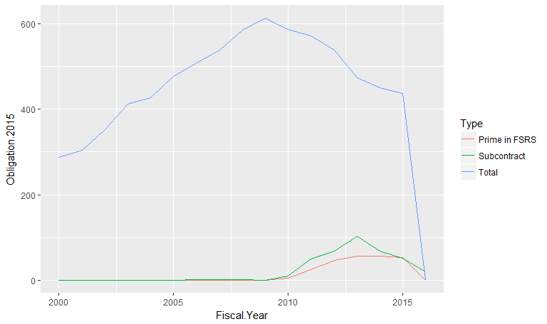
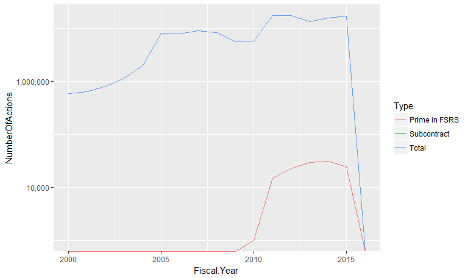
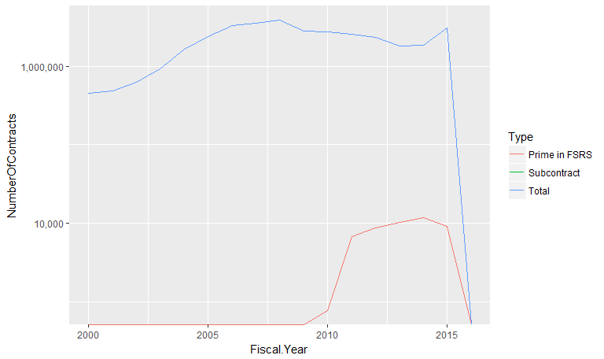

# Prime and sub contracting data processing
Greg Sanders  
July 14, 2016  

This is an R Markdown document. Markdown is a simple formatting syntax for authoring HTML, PDF, and MS Word documents. For more details on using R Markdown see <http://rmarkdown.rstudio.com>.

When you click the **Knit** button a document will be generated that includes both content as well as the output of any embedded R code chunks within the document. You can embed an R code chunk like this:

#Requirements

```r
require(plyr)
```

```
## Loading required package: plyr
```

```r
require(ggplot2)
```

```
## Loading required package: ggplot2
```

```r
require(scales)
```

```
## Loading required package: scales
```

```r
# Path<-"K:\\2007-01 PROFESSIONAL SERVICES\\R scripts and data\\"
Path<-"D:\\Users\\Greg Sanders\\Documents\\Development\\R-scripts-and-data\\"
source(paste(Path,"lookups.r",sep=""))
```

```
## Loading required package: stringr
```

```r
source(paste(Path,"helper.r",sep=""))
```

```
## Loading required package: grid
```

```
## Loading required package: reshape2
```

```
## Loading required package: lubridate
```

```
## 
## Attaching package: 'lubridate'
```

```
## The following object is masked from 'package:plyr':
## 
##     here
```

```
## The following object is masked from 'package:base':
## 
##     date
```

```r
Coloration<-read.csv(
  paste(Path,"Lookups\\","Lookup_coloration.csv",sep=""),
  header=TRUE, sep=",", na.strings="NA", dec=".", strip.white=TRUE, 
  stringsAsFactors=FALSE
)

#Clear out lines from the coloration CSV where no variable is listed.
Coloration<-subset(Coloration, variable!="")
```


#Read And Processs

```r
#This really shouldn't just be Canada related, but working with what I have.
FSRStopline  <- read.csv(file.path("Data","Contract_FSRSinFPDShistory.csv"),
                     na.strings=c("NULL","NA"),
                     header=TRUE)

FSRStopline<-subset(FSRStopline,fiscal_year>=2000)

FSRStopline<-ddply(FSRStopline,
                   .(fiscal_year,IsInFSRS),
                   summarize,
                   PrimeObligatedAmount=sum(PrimeObligatedAmount,na.rm=TRUE),
                   SubawardAmount=sum(SubawardAmount,na.rm=TRUE),
                   NumberOfActions=sum(NumberOfActions,na.rm=TRUE),
                   NumberOfContracts=sum(NumberOfContracts,na.rm=TRUE))

FSRStopline<-ddply(FSRStopline,
                   .(fiscal_year),
                   transform,
                   PrimeObligatedTotal=sum(PrimeObligatedAmount,na.rm=TRUE),
                   TotalOfActions=sum(NumberOfActions,na.rm=TRUE),
                   TotalOfContracts=sum(NumberOfContracts,na.rm=TRUE),
                   RowCount=length(fiscal_year))


FSRStopline$PrimeObligatedAmount<-FSRStopline$PrimeObligatedAmount*FSRStopline$IsInFSRS
FSRStopline$NumberOfActions<-FSRStopline$NumberOfActions*FSRStopline$IsInFSRS
FSRStopline$NumberOfContracts<-FSRStopline$NumberOfContracts*FSRStopline$IsInFSRS

FSRStopline<-subset(FSRStopline,
                    IsInFSRS==1 | RowCount==1, 
                    select=-c(IsInFSRS,RowCount))

FSRStopline<-melt(FSRStopline,
                  .(fiscal_year),
                  variable.name = "ContractMetric")

FSRStopline<-read_and_join(
            ""
            ,"Lookup_ContractMetric.csv"
            ,FSRStopline
        )
```

```
## Joining by: ContractMetric
```

```r
FSRStopline<-dcast(FSRStopline,
      fiscal_year + Type ~ ContractMetricType,
      value.var="value"
     )

FSRStopline<-apply_lookups(Path,FSRStopline)
```

```
## Joining by: Fiscal.Year
```

```r
ggplot(data=FSRStopline,
       aes(x=Fiscal.Year,
           y=Obligation.2015,
                       color=Type)
       )+geom_line()+
  scale_y_continuous(labels=comma
        )
```

<!-- -->

```r
ggplot(data=FSRStopline,
       aes(x=Fiscal.Year,
           y=NumberOfActions,
                       color=Type)
       )+geom_line()+
  scale_y_log10(labels=comma
        )
```

```
## Warning: Transformation introduced infinite values in continuous y-axis
```

<!-- -->

```r
ggplot(data=FSRStopline,
       aes(x=Fiscal.Year,
           y=NumberOfContracts,
                       color=Type)
       )+geom_line()+
  scale_y_log10(labels=comma
        )
```

```
## Warning: Transformation introduced infinite values in continuous y-axis
```

<!-- -->

#Prime and Sub Top Level

```r
FSRSsummary<-read.csv(file.path("Data","Contract_FSRSinFPDShistory.csv"),
                     na.strings=c("NULL","NA"),
                     header=TRUE)
FSRSsummary<-subset(FSRSsummary,fiscal_year>1990)
FSRSsummary<-apply_lookups(Path,FSRSsummary)
```

```
## Joining by: Fiscal.Year
```
